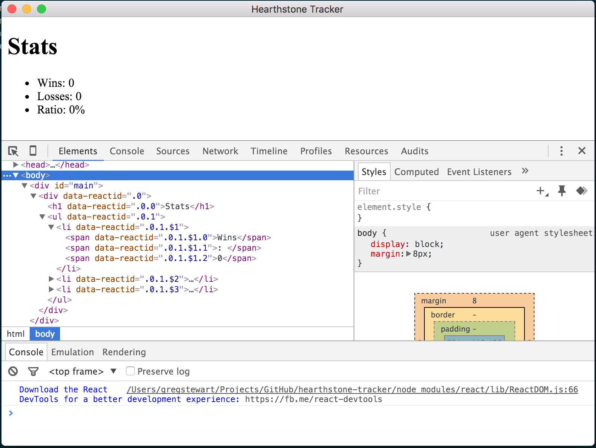

# hearthstone-tracker
An electron based Hearthstone tracker

To get started:

`git clone git@github.com:gregstewart/hearthstone-tracker.git && cd hearthstone-tracker`

Then run:

`npm i && npm start`

After a shortish time you should see something like the below the firs time you start the app:

Launch `Hearthstone` and play a few games, the UI *should* update after each completed game. 

To run the tests:

`npm test`

## Some reources:
* [Simple Hearthstone logging - see your complete play history without TCP, screen capture, or violating the TOS](https://www.reddit.com/r/hearthstone/comments/268fkk/simple_hearthstone_logging_see_your_complete_play)
* [hearthstone-log-watcher](https://www.npmjs.com/package/hearthstone-log-watcher)
* [hearthstone-log-adapter](https://www.npmjs.com/package/hearthstone-log-adapter)

## For packaging
* [electron-packager](https://github.com/maxogden/electron-packager)
